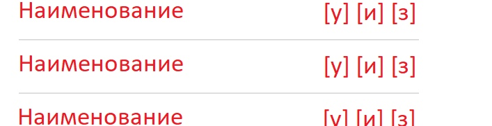

# Тестовое задание React/Redux/SCSS

Предлагается реализовать тестовое задание, проверяющее навыки владения React/Redux/SCSS.
Ориентировочное время выполнения: _~5 часов_. Готовое приложение _должно_ быть размещено 
на хостинге репозиториев (github, gitlab, bitbucket или другая на выбор) с предоставленным 
доступом для возможности оценки. 

## Описание

Написать компактное приложение с таблицой и одной формой

**Форма**:

Одно поле ввода и кнопка "Добавить"

**Таблица**:

2 столбца - первый - это наименование, второй - это панель действий.

**Действия**:

- удалить (символ `у`)
- изменить (символ `и`)
- пометить как завершенное (символ `з`)

### Внешний вид

### Вид таблицы с формой

### Элементы

#### Наименование события

Вместо этого текста будет отображаться наименование события (значение, которое было введено в поле `событие` и добавлено (с помощью кнопки `Добавить`)

#### Кнопка удаления

Кнопка будет осуществлять удаление поля из таблицы.

#### Кнопка редактирования

Кнопка должна делать поле редактируемым (создавать возможность изменения наименования события).

После нажатия на кнопку редактирования (`[и]`) поле должно изменить разметку на такого рода:

где:
- `[п]` - применить изменения (после нажатия поле становится таким же как раньше, только изменяется наименование события).
- `[о]` - отменить изменения (отменять изменения, т.е. любые изменения поля ввода сбрасываются).

#### Кнопка завершения

Кнопка должна помечать поле завершенным.

После на кнопку завершить поле должно выглядить примерно так:

## Особенности разработки

1. Использование React.
2. Верстка: SCSS + BEM методология. 
3. Использование Redux.
4. После перезагрузки страницы состояние приложения не должно поменяться.
